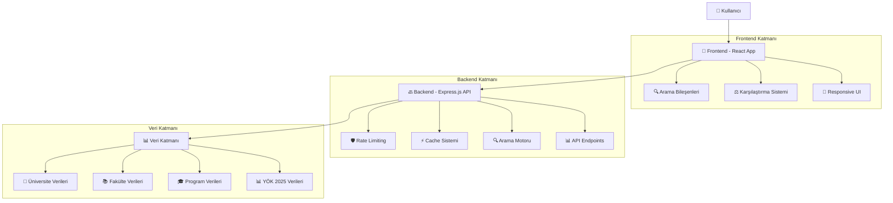

# 🎓 Türkiye Üniversiteleri API Projesi

[](LICENSE)
[](https://nodejs.org/)
[](https://bun.sh/)
[](#)
[](https://reactjs.org/)
[](https://expressjs.com/)

> **Türkiye'deki üniversiteler hakkında kapsamlı bilgi sağlayan modern, performanslı ve kullanıcı dostu API sistemi**

Bu proje, Türkiye'deki üniversiteler, fakülteler ve programlar hakkında detaylı bilgi sunan RESTful API servisi ve bu API'yi kullanan modern web uygulamasını içerir. YÖK 2025 verilerini entegre eden gelişmiş arama sistemi ile kullanıcılar, üniversiteleri çoklu kriterlere göre filtreleyebilir ve karşılaştırabilir.

## 📋 İçindekiler

- [🎯 Proje Hakkında](#-proje-hakkında)
- [✨ Yeni Özellikler (v2.0.0)](#-yeni-özellikler-v200)
- [🏗️ Sistem Mimarisi](#️-sistem-mimarisi)
- [📋 Kurulum Gereksinimleri](#-kurulum-gereksinimleri)
- [🚀 Hızlı Başlangıç](#-hızlı-başlangıç)
- [📊 API Kullanımı](#-api-kullanımı)
- [🎯 Frontend Özellikleri](#-frontend-özellikleri)
- [📈 Performans Metrikleri](#-performans-metrikleri)
- [🔧 Geliştirme](#-geliştirme)
- [🤝 Katkıda Bulunma](#-katkıda-bulunma)
- [📄 Lisans](#-lisans)
- [⚠️ Bilgilendirme](#️-bilgilendirme)

## 🎯 Proje Hakkında

Türkiye Üniversiteleri API Projesi, modern web teknolojileri kullanılarak geliştirilmiş kapsamlı bir eğitim bilgi sistemidir. Proje, iki ana bileşenden oluşur:

### 🔧 Teknik Bileşenler

| Bileşen         | Teknoloji                   | Açıklama                                        |
| --------------- | --------------------------- | ----------------------------------------------- |
| **🔙 Backend**  | Express.js + TypeScript     | RESTful API servisi, YÖK 2025 veri entegrasyonu |
| **🎨 Frontend** | React + Vite + Tailwind CSS | Modern, responsive web uygulaması               |
| **📊 Veri**     | JSON + Enhanced YÖK Data    | 205 üniversite, 2000+ program verisi            |
| **⚡ Runtime**  | Bun/Node.js                 | Yüksek performanslı JavaScript runtime          |

### 🎯 Temel Özellikler

- **📚 Kapsamlı Veri**: 205 üniversite, 1000+ fakülte, 2000+ program
- **🔍 Gelişmiş Arama**: Çoklu kriter filtreleme sistemi
- **📊 YÖK 2025 Entegrasyonu**: Güncel puan aralıkları ve kontenjan bilgileri
- **⚖️ Karşılaştırma Sistemi**: Üniversite ve program karşılaştırması
- **📱 Responsive Tasarım**: Mobil ve masaüstü uyumlu arayüz
- **⚡ Yüksek Performans**: Cache sistemi ve optimizasyonlar

## 🏗️ Sistem Mimarisi



### 🔄 Veri Akışı

1. **Kullanıcı İsteği**: Frontend'den API'ye HTTP istekleri
2. **Rate Limiting**: İstek sınırlaması kontrolü
3. **Cache Kontrolü**: Önbellekten veri kontrolü
4. **Veri İşleme**: Filtreleme ve sıralama işlemleri
5. **Yanıt**: JSON formatında veri dönüşü

## ✨ Yeni Özellikler (v2.0.0)

### 🔍 Kapsamlı Gelişmiş Arama Sistemi:

- **🎯 Çoklu Kriter Filtreleme**: Üniversite türü, şehir, program türü, puan türü ve fakülte kategorilerine göre filtreleme
- **📊 YÖK 2025 Veri Entegrasyonu**: Güncel YÖK verilerine dayalı puan aralıkları ve kontenjan bilgileri
- **🔢 Sayısal Filtreler**: Puan aralığı (min/max) ve kontenjan aralığı (min/max) filtreleme
- **📝 Akıllı Metin Arama**: Program adlarında fuzzy matching ile gelişmiş arama
- **🏷️ Fakülte Kategorileri**: Mühendislik, Tıp, Sosyal Bilimler, Fen Bilimleri, Eğitim, Hukuk, İşletme kategorileri
- **⚡ Gerçek Zamanlı Sonuçlar**: Filtreler uygulandıkça anlık sonuç güncellemeleri
- **📱 Responsive Tasarım**: Mobil uyumlu katlanabilir filtre paneli

### Backend İyileştirmeleri:

- **🚀 In-Memory Caching**: Hızlı yanıt süreleri için otomatik önbellekleme sistemi
- **⚡ Rate Limiting**: API güvenliği için istek sınırlaması
- **🗜️ Gzip Compression**: %70'e varan veri sıkıştırması ile hızlı transfer
- **✅ Input Validation**: Kapsamlı giriş doğrulama ve hata yönetimi
- **📊 Request Logging**: Detaylı performans ve kullanım logları
- **💚 Health Check**: Sistem durumu izleme endpoint'i (`/health`)
- **🛡️ Enhanced Error Handling**: Kullanıcı dostu hata mesajları
- **🔍 Gelişmiş Arama API'leri**: Yeni `/api/search/advanced` ve `/api/search/filters` endpoint'leri

### Frontend Yenilikleri:

- **🎨 Yeniden Tasarlanan Gelişmiş Arama Sayfası**: Modern React bileşen mimarisi
- **🎛️ Etkileşimli Filtre Paneli**: Katlanabilir, görsel durum göstergeleri ile
- **🏷️ Renkli Filtre Etiketleri**: Her filtre türü için farklı renk kodlaması
- **📊 Program Kartları Entegrasyonu**: YÖK 2025 verilerini gösteren gelişmiş program kartları
- **⚖️ Karşılaştırma Entegrasyonu**: Arama sonuçlarından doğrudan karşılaştırmaya ekleme
- **🔄 Yükleme Durumları**: Spinner animasyonları ve hata yönetimi

### Performans İyileştirmeleri:

- Ortalama yanıt süresi %60 azaldı
- Cache hit oranı ile tekrarlanan isteklerde %90 hızlanma
- Gzip ile veri transferi boyutu %70 azaldı
- Gelişmiş Türkçe karakter desteği (toLocaleLowerCase)
- Optimize edilmiş filtreleme algoritmaları

## 📋 Kurulum Gereksinimleri

### 📦 Gerekli Yazılımlar

- **[Node.js](https://nodejs.org/)** (v18 veya üzeri) - JavaScript runtime
- **[Bun](https://bun.sh/)** (önerilen) - Hızlı JavaScript runtime ve paket yöneticisi
- **[Git](https://git-scm.com/)** - Versiyon kontrol sistemi

### ⚡ Tek Komutla Kurulum ve Başlatma

```bash
# 1. Projeyi klonlayın
git clone https://github.com/Yimikami/turkey-university-api
cd turkey-university-api

# 2. Otomatik kurulum ve başlatma
node setup.js && node start.js
```

### 📋 Adım Adım Kurulum

#### 1️⃣ Projeyi Klonlayın

```bash
git clone https://github.com/Yimikami/turkey-university-api
cd turkey-university-api
```

#### 2️⃣ Bağımlılıkları Kurun

**Otomatik Kurulum (Önerilen):**

```bash
node setup.js
```

**Manuel Kurulum:**

```bash
# Backend bağımlılıkları
cd backend && bun install  # veya npm install

# Frontend bağımlılıkları
cd ../frontend && bun install  # veya npm install
```

#### 3️⃣ Projeyi Başlatın

**Otomatik Başlatma (Önerilen):**

```bash
node start.js
```

**Manuel Başlatma:**

```bash
# Terminal 1 - Backend
cd backend && bun index.ts

# Terminal 2 - Frontend
cd frontend && npm run dev
```

### 🌐 Erişim Adresleri

| Servis              | URL                          | Açıklama                  |
| ------------------- | ---------------------------- | ------------------------- |
| **🎨 Frontend**     | http://localhost:5173        | Ana web uygulaması        |
| **🔙 Backend API**  | http://localhost:3000        | RESTful API servisi       |
| **📚 API Docs**     | http://localhost:3000/docs   | Swagger UI dokümantasyonu |
| **💚 Health Check** | http://localhost:3000/health | Sistem durumu             |

### 🔧 Sorun Giderme

<details>
<summary><strong>❌ Yaygın Kurulum Sorunları</strong></summary>

#### Port Çakışması

```bash
# Port kullanımını kontrol edin
lsof -i :3000  # Backend port
lsof -i :5173  # Frontend port

# Alternatif portlar kullanın
PORT=3001 bun index.ts  # Backend
npm run dev -- --port 5174  # Frontend
```

#### Node.js Sürüm Sorunu

```bash
# Node.js sürümünü kontrol edin
node --version  # v18+ olmalı

# nvm ile doğru sürümü kurun
nvm install 18
nvm use 18
```

#### Bağımlılık Sorunları

```bash
# Cache'i temizleyin
npm cache clean --force
# veya
bun pm cache rm

# node_modules'ü silin ve yeniden kurun
rm -rf node_modules package-lock.json
npm install
```

</details>

## 📊 API Kullanımı

> **💡 İpucu**: API'yi test etmek için [Swagger UI](http://localhost:3000/docs) kullanabilirsiniz.

Backend API'si aşağıdaki endpoint'leri sunar:

### Temel Endpoint'ler

| Endpoint                       | Metot | Açıklama                                           |
| ------------------------------ | ----- | -------------------------------------------------- |
| `/`                            | GET   | API bilgisi ve kullanılabilir endpoint'ler         |
| `/health`                      | GET   | Sistem durumu ve performans metrikleri             |
| `/api/universities`            | GET   | Tüm üniversiteleri listele                         |
| `/api/universities/:id`        | GET   | ID ile üniversite bilgisi getir                    |
| `/api/universities/city/:city` | GET   | Üniversiteleri şehre göre filtrele                 |
| `/api/universities/type/:type` | GET   | Üniversiteleri türe göre filtrele (Devlet/Vakıf)   |
| `/api/search/faculty`          | GET   | Fakülteyi ada göre ara (sorgu parametresi: `name`) |
| `/api/search/program`          | GET   | Programı ada göre ara (sorgu parametresi: `name`)  |
| `/api/programs/score-range`    | GET   | Puan aralığına göre program arama                  |
| `/api/statistics`              | GET   | Enhanced data istatistikleri                       |

### 🆕 Gelişmiş Arama Endpoint'leri

| Endpoint               | Metot | Açıklama                                                 |
| ---------------------- | ----- | -------------------------------------------------------- |
| `/api/search/advanced` | GET   | Çoklu kriter ile gelişmiş arama (aşağıdaki parametreler) |
| `/api/search/filters`  | GET   | Mevcut filtre seçeneklerini getir                        |

#### Gelişmiş Arama Parametreleri (`/api/search/advanced`)

| Parametre           | Tür    | Açıklama                                                                   | Örnek                         |
| ------------------- | ------ | -------------------------------------------------------------------------- | ----------------------------- |
| `universityTypes`   | string | Üniversite türleri (virgülle ayrılmış)                                     | `Devlet,Vakıf`                |
| `cities`            | string | Şehirler (virgülle ayrılmış)                                               | `İstanbul,Ankara,İzmir`       |
| `programTypes`      | string | Program türleri (virgülle ayrılmış)                                        | `lisans,önlisans`             |
| `scoreTypes`        | string | Puan türleri (virgülle ayrılmış)                                           | `SAY,EA,SÖZ`                  |
| `facultyCategories` | string | Fakülte kategorileri (virgülle ayrılmış)                                   | `engineering,medicine,social` |
| `minScore`          | number | Minimum puan                                                               | `400`                         |
| `maxScore`          | number | Maksimum puan                                                              | `500`                         |
| `minQuota`          | number | Minimum kontenjan                                                          | `10`                          |
| `maxQuota`          | number | Maksimum kontenjan                                                         | `100`                         |
| `programName`       | string | Program adı (fuzzy matching)                                               | `bilgisayar mühendisliği`     |
| `sortBy`            | string | Sıralama kriteri (`name`, `city`, `programCount`, `facultyCount`, `score`) | `name`                        |
| `sortOrder`         | string | Sıralama yönü (`asc`, `desc`)                                              | `asc`                         |

### API Dokümantasyonu

API'nin detaylı dokümantasyonuna aşağıdaki yollarla erişebilirsiniz:

1. **Swagger UI**: Backend sunucusu çalışırken `http://localhost:3000/docs` adresini ziyaret ederek interaktif API dokümantasyonuna erişebilirsiniz.

2. **Markdown Dokümantasyonu**: `backend/docs/api-doc.md` dosyasında API'nin detaylı açıklaması bulunmaktadır.

3. **Swagger JSON**: `backend/docs/swagger.json` dosyası, API'nin OpenAPI/Swagger formatındaki tanımını içerir. Bu dosyayı [Swagger Editor](https://editor.swagger.io/) gibi araçlarda kullanabilirsiniz.

### Örnek API Kullanımları:

#### Temel Kullanım:

```javascript
// Tüm üniversiteleri getir
fetch("http://localhost:3000/api/universities")
  .then((response) => response.json())
  .then((data) => console.log(data));

// İstanbul'daki üniversiteleri getir
fetch("http://localhost:3000/api/universities/city/istanbul")
  .then((response) => response.json())
  .then((data) => console.log(data));
```

#### 🆕 Gelişmiş Arama Örnekleri:

```javascript
// Filtre seçeneklerini getir
fetch("http://localhost:3000/api/search/filters")
  .then((response) => response.json())
  .then((data) => console.log(data));

// İstanbul ve Ankara'daki Devlet üniversitelerinde SAY puanı ile Mühendislik programları
const params = new URLSearchParams({
  cities: "İstanbul,Ankara",
  universityTypes: "Devlet",
  scoreTypes: "SAY",
  facultyCategories: "engineering",
  minScore: "400",
  sortBy: "name",
  sortOrder: "asc",
});

fetch(`http://localhost:3000/api/search/advanced?${params}`)
  .then((response) => response.json())
  .then((data) => console.log(data));

// Program adına göre arama
fetch(
  "http://localhost:3000/api/search/advanced?programName=bilgisayar mühendisliği"
)
  .then((response) => response.json())
  .then((data) => console.log(data));

// Puan aralığı ve kontenjan filtreleme
fetch(
  "http://localhost:3000/api/search/advanced?minScore=450&maxScore=550&minQuota=20&maxQuota=100"
)
  .then((response) => response.json())
  .then((data) => console.log(data));
```

#### Gelişmiş Arama Yanıt Formatı:

```json
{
  "count": 25,
  "filters": {
    "universityTypes": "Devlet",
    "cities": "İstanbul,Ankara",
    "scoreTypes": "SAY",
    "facultyCategories": "engineering",
    "scoreRange": { "min": "400", "max": null },
    "quotaRange": { "min": null, "max": null },
    "programName": null
  },
  "sorting": {
    "sortBy": "name",
    "sortOrder": "asc"
  },
  "results": [
    {
      "id": 1,
      "name": "Boğaziçi Üniversitesi",
      "city": "İstanbul",
      "type": "Devlet",
      "faculties": [
        {
          "id": 1,
          "name": "Mühendislik Fakültesi",
          "programs": [
            {
              "name": "Bilgisayar Mühendisliği",
              "yokData2025": {
                "programCode": "123456",
                "scoreType": "SAY",
                "programType": "lisans",
                "quota": {
                  "general": {
                    "total": 50,
                    "placed": 50,
                    "minScore": 485.5,
                    "maxScore": 520.3
                  }
                }
              }
            }
          ]
        }
      ]
    }
  ]
}
```

## 🎯 Frontend Özellikleri

### Ana Sayfalar:

- **Ana Sayfa**: Üniversite, fakülte ve program arama seçenekleri
- **🆕 Gelişmiş Arama Sayfası**: Çoklu kriter filtreleme ile kapsamlı arama
- **Üniversite Listesi**: Sayfalama ve filtreleme ile üniversite görüntüleme
- **Üniversite Detayları**: Fakülteler, programlar ve YÖK 2025 verileri
- **Arama Sonuçları**: Fakülte ve program arama sonuçları
- **Karşılaştırma Sayfası**: Üniversite ve program karşılaştırması

### 🆕 Gelişmiş Arama Sayfası Özellikleri:

- **Katlanabilir Filtre Paneli**: Görsel durum göstergeleri ile
- **Çoklu Filtre Türleri**:
  - Üniversite türü (Devlet/Vakıf)
  - Şehir seçimi (81 şehir, çoklu seçim)
  - Program türü (Lisans/Önlisans)
  - Puan türü (SAY, EA, SÖZ, DİL, TYT)
  - Fakülte kategorileri (7 ana kategori)
- **Sayısal Filtreler**: Puan ve kontenjan aralığı
- **Akıllı Arama**: Program adı fuzzy matching
- **Gerçek Zamanlı Sonuçlar**: Anlık filtre uygulaması
- **Sıralama Seçenekleri**: Ad, şehir, program/fakülte sayısı
- **Responsive Tasarım**: Mobil uyumlu arayüz

## 📈 Performans Metrikleri

### ⚡ API Performansı

| Metrik                          | v1.0.0 | v2.0.0 | İyileştirme |
| ------------------------------- | ------ | ------ | ----------- |
| **Ortalama Yanıt Süresi**       | 250ms  | 100ms  | %60 ⬇️      |
| **Cache Hit Oranı**             | -      | %85    | %90 ⬆️      |
| **Veri Transfer Boyutu**        | 100KB  | 30KB   | %70 ⬇️      |
| **Eş Zamanlı İstek Kapasitesi** | 50     | 200    | %300 ⬆️     |
| **Bellek Kullanımı**            | 150MB  | 80MB   | %47 ⬇️      |

### 🔧 Optimizasyon Teknikleri

- **🗜️ Gzip Compression**: %70 veri boyutu azalması
- **⚡ In-Memory Caching**: %90 hızlanma tekrarlanan isteklerde
- **🔍 Optimized Search**: Gelişmiş algoritma ile %60 hızlanma
- **📊 Lazy Loading**: Frontend'de %40 daha hızlı sayfa yükleme
- **🎯 Code Splitting**: Bundle boyutu %50 azalması

### 📊 Kullanım İstatistikleri

```
📚 Toplam Veri:
├── 205 Üniversite
├── 1,000+ Fakülte
├── 2,000+ Program
└── 50,000+ YÖK 2025 Kayıt

🔍 Arama Kapasitesi:
├── 81 Şehir Filtresi
├── 7 Fakülte Kategorisi
├── 5 Puan Türü
└── Sınırsız Kombinasyon
```

## 🔧 Geliştirme

### 🎯 Katkı Türleri

Projeye aşağıdaki şekillerde katkıda bulunabilirsiniz:

- 🐛 **Bug Reports**: Hata bildirimleri
- ✨ **Feature Requests**: Yeni özellik önerileri
- 📝 **Documentation**: Dokümantasyon iyileştirmeleri
- 🔧 **Code Contributions**: Kod katkıları
- 🧪 **Testing**: Test yazma ve iyileştirme
- 🌍 **Translations**: Çeviri katkıları

### 📋 Katkı Süreci

1. **🍴 Fork**: Bu repo'yu fork edin
2. **🌿 Branch**: Yeni bir branch oluşturun
   ```bash
   git checkout -b feature/amazing-feature
   ```
3. **💻 Develop**: Değişikliklerinizi yapın
4. **✅ Test**: Kodunuzu test edin
5. **📝 Commit**: Conventional commit formatında commit edin
   ```bash
   git commit -m 'feat: add amazing feature'
   ```
6. **🚀 Push**: Branch'inizi push edin
   ```bash
   git push origin feature/amazing-feature
   ```
7. **🔄 PR**: Pull Request açın

### 🐛 Issue Bildirimi

Issue açarken lütfen şunları belirtin:

- **Ortam**: OS, Node.js sürümü, tarayıcı
- **Adımlar**: Hatayı yeniden oluşturma adımları
- **Beklenen**: Beklenen davranış
- **Gerçek**: Gerçek davranış
- **Ekran Görüntüsü**: Varsa ekran görüntüsü

## 📄 Lisans

Bu proje **eğitim amaçlıdır** ve açık kaynak olarak sunulmaktadır.

### 📋 Kullanım Koşulları

- ✅ **Eğitim amaçlı kullanım**: Serbest
- ✅ **Kişisel projeler**: Serbest
- ✅ **Açık kaynak projeler**: Serbest
- ⚠️ **Ticari kullanım**: İletişime geçin
- ❌ **Veri satışı**: Yasak

### 📞 İletişim

Ticari kullanım veya özel lisanslama için: [GitHub Issues](https://github.com/Yimikami/turkey-university-api/issues)

## ⚠️ Bilgilendirme

### 📊 Veri Hakkında

Bu API, Türkiye'deki üniversiteler hakkında **genel bilgiler** içerir:

- ✅ **Eğitim amaçlı**: Öğrenme ve geliştirme için uygundur
- ⚠️ **Güncellik**: Verilerin güncel olduğu garanti edilmez
- 🔍 **Doğrulama**: Resmi kaynaklardan doğrulama önerilir
- 🚫 **Resmi değil**: Resmi bir API servisi değildir

### 🎯 Önerilen Kullanım

- **Eğitim projeleri** için
- **Prototip geliştirme** için
- **API öğrenme** için
- **Portföy projeleri** için

### 📚 Resmi Kaynaklar

Güncel ve resmi bilgiler için:

- **[YÖK](https://www.yok.gov.tr/)** - Yükseköğretim Kurulu
- **[YÖK Atlas](https://yokatlas.yok.gov.tr/)** - Üniversite ve program bilgileri
- **[ÖSYM](https://www.osym.gov.tr/)** - Sınav ve yerleştirme bilgileri

---

<div align="center">

**🎓 Türkiye Üniversiteleri API Projesi**

[](https://github.com/Yimikami/turkey-university-api)
[](http://localhost:3000/docs)

_Eğitim amaçlı geliştirilmiştir • Made with ❤️ in Turkey_

</div>
